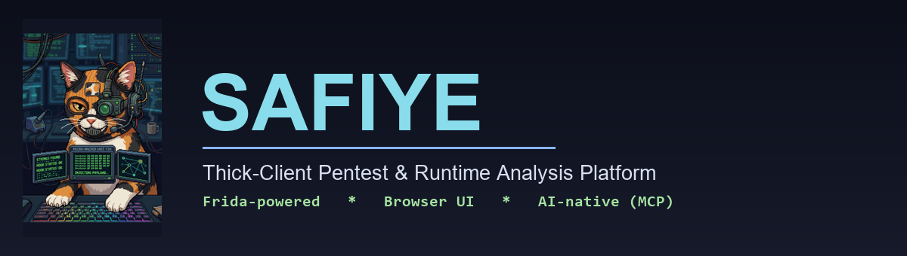
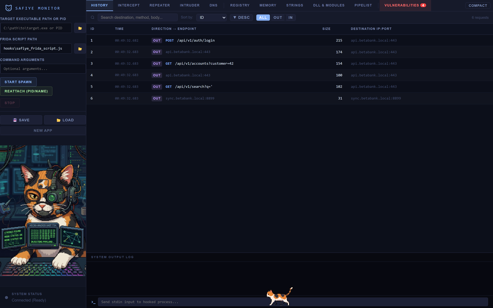
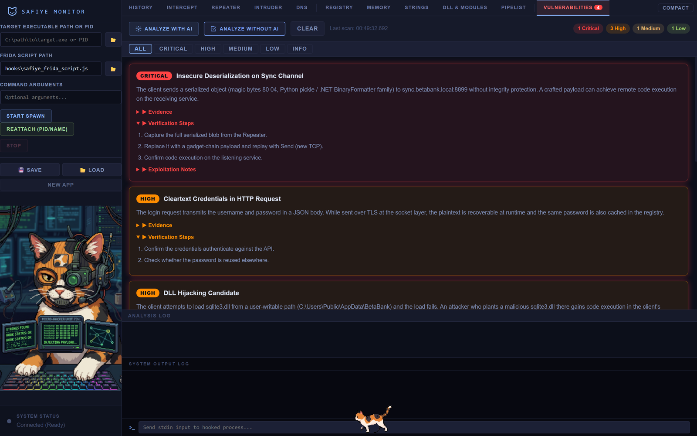
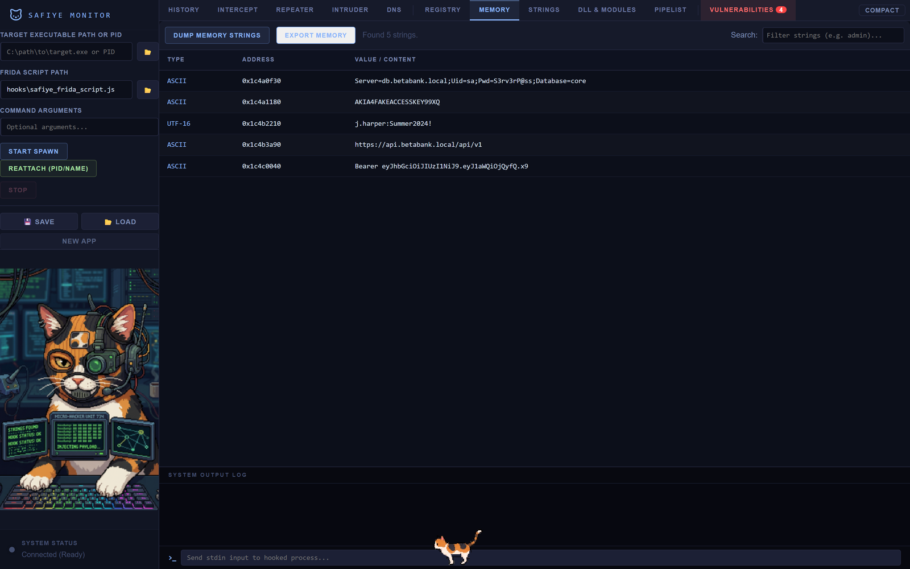
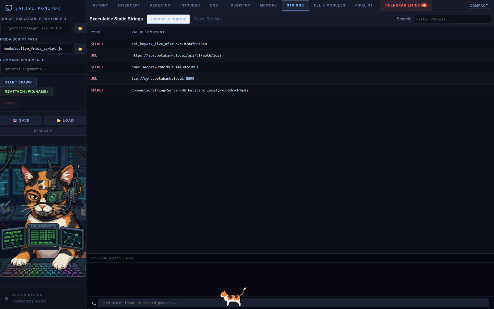
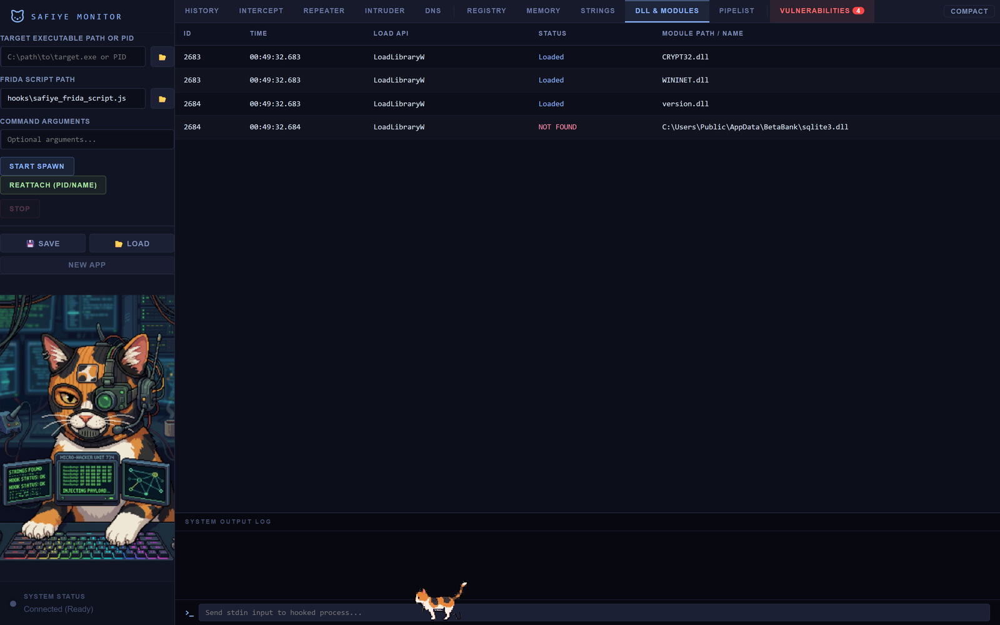
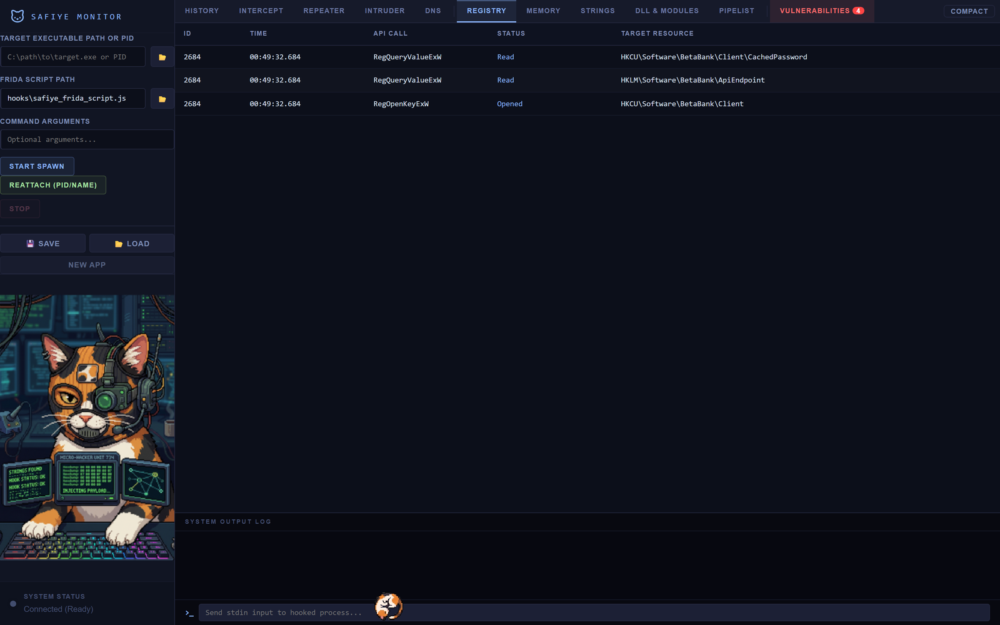
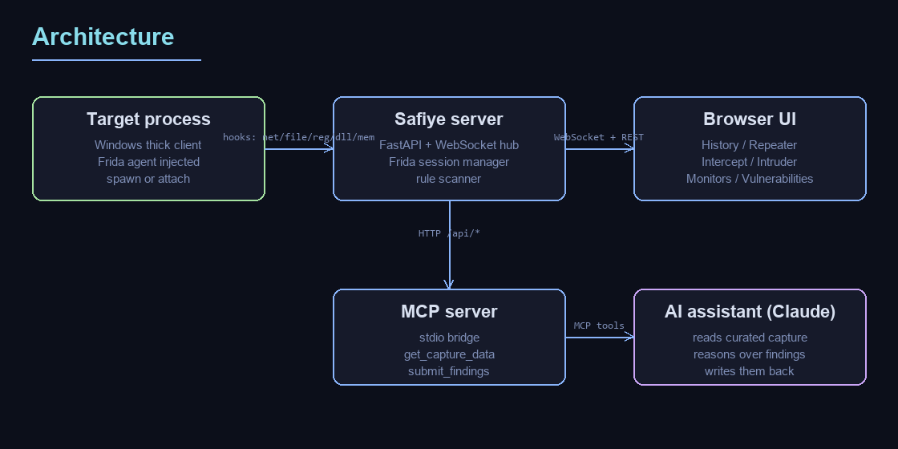

<p align="center">
  
</p>

<p align="center">
  
  
  
  
  
</p>

# Safiye

Safiye is a runtime security analysis tool for Windows thick-client (desktop) applications. It injects a [Frida](https://frida.re) agent into the target process and shows what it sees (network traffic, files, registry, DLLs, memory, IPC) in a browser UI, so you don't need a traditional debugger. It also speaks the Model Context Protocol (MCP), which lets an AI assistant read the captured data and write findings back into the tool.

<p align="center">
  
</p>

---

## Features

- **Spawn or attach.** Launch the target and hook it from the first instruction, or attach to a process that is already running by PID or name.
- **Network capture.** Hooks `ws2_32` (`send`, `recv`, `WSASend`, `WSARecv`, `connect`), the AFD NT layer, and OpenSSL, and de-duplicates the result.
- **Intercept and Trap.** Hold outgoing packets, edit them in UTF-8 or HEX, then forward or drop them. You can also inject your own responses.
- **Repeater.** Replay any packet. There are two send modes:
  - *Send (new TCP)* opens a fresh connection to the target and replays the bytes, so it works even after the original socket has closed.
  - *Send (live socket)* injects into the original connection while it is still open.
  - *Load payload file* imports a raw blob (for example a serialized deserialization payload) and sends it over the wire as HEX.
- **Intruder.** Fuzz a request template with a list of payloads.
- **Runtime monitors.** DNS, registry, file system, and DLL load events. Failed loads on writable paths are flagged as hijack candidates.
- **Memory and Strings.** Dump readable memory and pull live strings, and scan the binary for hardcoded secrets.
- **Named pipes.** Enumerate Windows named pipes for IPC and privilege-escalation paths.
- **Vulnerability detection.** Insecure deserialization (Java, .NET, Python pickle, PHP magic bytes), DLL hijacking, and SQL-injection patterns in HTTP bodies. The rule scanner is deterministic and needs no AI.
- **AI analysis (MCP).** Claude, or any MCP client, can read a cleaned-up, decoded view of the capture and submit findings back into the Vulnerabilities tab.

> The project is named after my cat, Safiye. That is her, the calico walking along the bottom of the window. Click her.

---

## Screenshots

<p align="center">
  
  <br><em>Vulnerabilities: rule-based and AI findings with evidence and verification steps.</em>
</p>

<table>
  <tr>
    <td width="50%"><br><em>Memory: live strings and recovered secrets.</em></td>
    <td width="50%"><br><em>Strings: embedded secrets, URLs, and keys.</em></td>
  </tr>
  <tr>
    <td width="50%"><br><em>DLL and Modules: loads, with hijack candidates flagged.</em></td>
    <td width="50%"><br><em>Registry: sensitive key access in real time.</em></td>
  </tr>
</table>

---

## Architecture

<p align="center">
  
</p>

The Frida agent inside the target streams events to the Safiye server (FastAPI with a WebSocket hub), which pushes them live to the browser UI. For AI analysis, a separate MCP server bridges Claude to the server's REST API.

---

## Installation

### Requirements

- Windows 10 or 11 (x64)
- Python 3.10 to 3.12 (the pinned `frida==16.6.4` has no wheels for 3.13+)
- Administrator privileges, since Frida needs them to spawn, attach, and hook

### Setup

```bash
git clone https://github.com/ErenCanOzmn/SafiyeMonitor.git
cd SafiyeMonitor
pip install -r requirements.txt
python src/safiye_server_prod.py
```

Then open http://localhost:5000 in your browser. Run the terminal as Administrator, otherwise hooking fails with "failed to start hook".

---

## Usage

1. **Target.** Enter the path to the target `.exe` (or a PID) in the sidebar, leave the Frida script as the default `hooks/safiye_frida_script.js`, and click **Start Spawn** (or **Reattach** for a process that is already running).
2. **Watch traffic.** Outgoing and incoming packets show up in **History** in real time. Click one to inspect the raw payload (UTF-8 or HEX).
3. **Intercept.** Flip the Trap toggle to hold packets, edit them, then forward or drop.
4. **Repeat.** Right-click a packet, choose **Send to Repeater**, tweak it, and replay with **Send (new TCP)**.
5. **Hunt.** Browse the Registry, File, DLL, Memory, and Strings tabs, then open **Vulnerabilities** and run **Analyze without AI** (rule scanner) or **Analyze with AI** (MCP).
6. **Save.** Export the session to JSON and reload it later.

---

## AI Analysis (MCP)

Safiye ships an MCP server that connects an AI assistant to live capture data.

| Tool | Description |
|---|---|
| `get_session_status` | Hook state, target info, packet counts |
| `get_capture_data` | The cleaned-up, decoded capture context for analysis |
| `get_vulnerability_report` | Current findings in the Vulnerabilities tab |
| `submit_findings` | Write AI-generated findings back into the UI |
| `log_progress` | Append a line to the System Output Log |

Register the MCP server with your Claude Code config (or `claude mcp add`):

```json
{
  "mcpServers": {
    "safiye": {
      "command": "python",
      "args": ["C:/path/to/SafiyeMonitor/src/mcp_server.py"]
    }
  }
}
```

With a process hooked, ask the assistant to analyze the capture. It calls `get_capture_data`, reasons over the cleaned-up context (which leads with the deterministic rule-scan findings as hints), and calls `submit_findings` to fill the Vulnerabilities tab. No API key or external service is needed when you run through Claude Code locally.

> Optional: the **Analyze with AI** button can also call the Anthropic API directly. To use it, set the `ANTHROPIC_API_KEY` environment variable, or copy `safiye_config.example.json` to `safiye_config.json` and add your key there (that file is gitignored). The MCP workflow above needs neither.

---

## Project structure

```
src/
  safiye_server_prod.py   FastAPI backend, WebSocket hub, Frida session manager
  mcp_server.py           MCP stdio bridge for AI integration
  templates/index.html    Single-page UI
  static/js/app.js        Frontend logic and WebSocket client
  static/js/catwalk.js    The mascot
  static/css/style.css    UI stylesheet
hooks/
  safiye_frida_script.js  Frida instrumentation injected into the target
requirements.txt
```

---

## Disclaimer

Safiye is for authorized security testing, CTF, and research only. Only use it against applications and systems you have explicit permission to test. The author is not responsible for misuse.

## License

MIT
