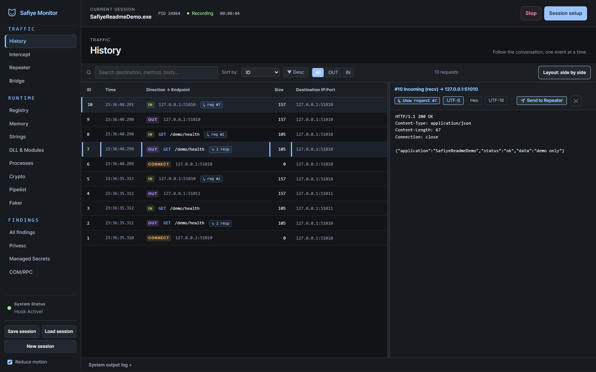
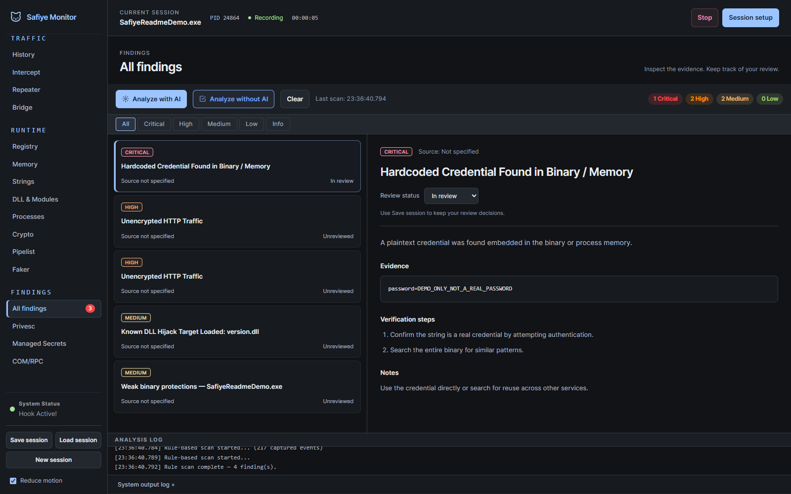
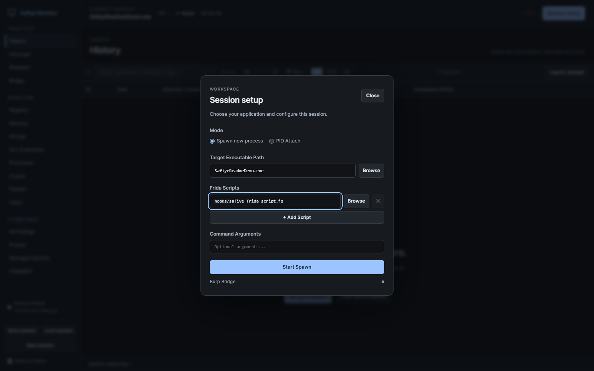
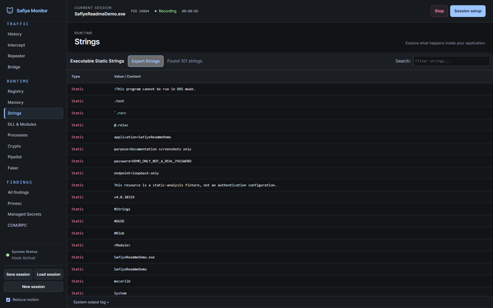
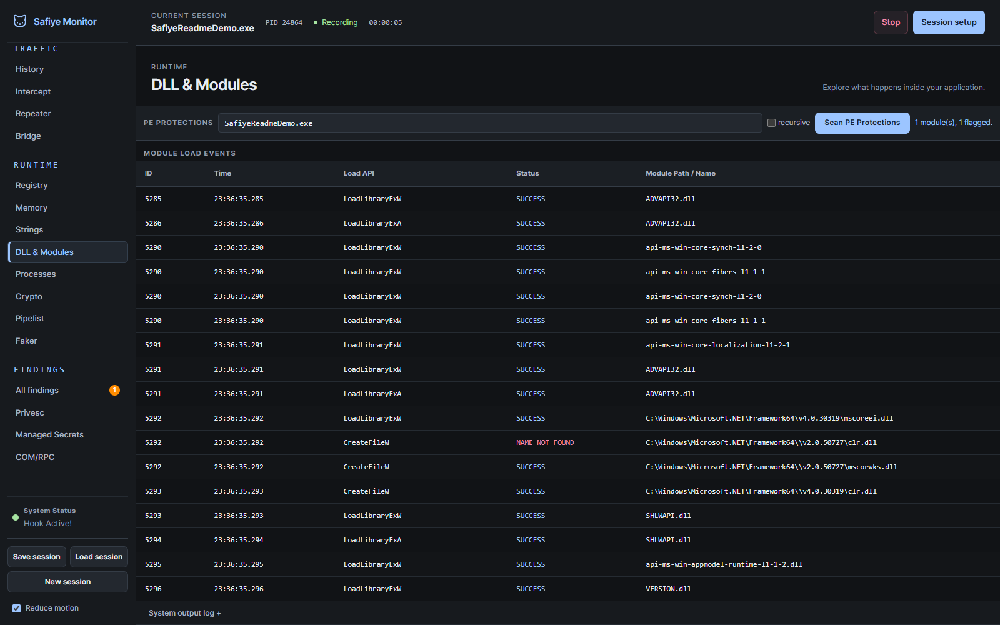

<p align="center">
  
</p>

<p align="center">
  Runtime security analysis for Windows desktop apps, with live traffic, runtime monitors, and AI-assisted findings.
</p>

<p align="center">
  
  
  
  
  
</p>

# Safiye

Safiye is a runtime security analysis tool for Windows thick-client (desktop) applications. It injects a [Frida](https://frida.re) agent into the target process and shows what it sees (network traffic, files, registry, DLLs, memory, IPC) in a browser UI, so you don't need a traditional debugger. It also speaks the Model Context Protocol (MCP), which lets an AI assistant read the captured data and write findings back into the tool.

<p align="center">
  
  <br><em>Live session context, grouped navigation, and a resizable traffic inspector.</em>
</p>

---

## Features

- **Focused workspace.** Graphite theme, tools grouped under Traffic / Runtime / Findings, a dedicated Session setup dialog, and a persistent target / PID / recording-status bar. Switch between stacked and side-by-side traffic inspection, resize the inspector, collapse the console, and reduce motion.
- **Finding review.** The default list contains only operator-confirmed vulnerabilities. Automatic scanner, runtime and AI signals go to a separate **Needs review** queue. A confidence label or an AI's claimed confirmation cannot bypass this gate. Save/Load preserves both queues and review decisions.
- **Spawn or attach.** Launch the target and hook it from the first instruction, or attach to a process that is already running by PID or name.
- **Network capture.** Hooks `ws2_32` (`send`, `recv`, `WSASend`, `WSARecv`, `connect`), the AFD NT layer, OpenSSL, and SChannel/SSPI (`EncryptMessage`/`DecryptMessage`, so .NET `SslStream`, WinHTTP and LDAPS plaintext is captured before encryption), and de-duplicates the result.
- **Intercept and Trap.** Hold outgoing packets, edit them in UTF-8 or HEX, then forward or drop them. You can also inject your own responses.
- **Repeater.** Replay any packet. There are two send modes:
  - *Send (new TCP)* opens a fresh connection to the target and replays the bytes, so it works even after the original socket has closed.
  - *Send (live socket)* injects into the original connection while it is still open.
  - *Load payload file* imports a raw blob (for example a serialized deserialization payload) and sends it over the wire as HEX.
- **Runtime monitors.** Registry, file system, and DLL load events. Failed loads on writable paths are flagged as hijack candidates.
- **Memory and Strings.** Dump readable memory and pull live strings, and scan the binary for hardcoded secrets.
- **Named pipes.** Enumerate Windows named pipes and read each pipe's DACL — a NULL DACL or one that lets a low-privileged principal write / create instances (a classic local-privesc path scanners miss) is flagged, and you can connect and send/fuzz from the UI.
- **PE protection analysis.** Read each module's PE header for exploit-mitigation flags (ASLR, DEP/NX, CFG, SEH) and verify its Authenticode signature — both embedded and **catalog** signed — so unprotected or genuinely unsigned application binaries stand out. .NET assemblies are scored as managed (native-flag gaps are not treated as high-risk).
- **COM/DCOM and RPC enumeration.** List the local RPC endpoint mapper (network-reachable `ncacn_ip_tcp` interfaces are highlighted) and analyze every DCOM AppID's Launch/Access permission, flagging the ones that let a low-privileged principal **remotely** activate/launch (the DCOM lateral-movement class); local-only rights are treated as normal.
- **Local privilege-escalation checks.** DLL-hijack candidates, unquoted service paths, writable install-directory / service ACLs, and insecure (HTTP / unsigned) update mechanisms.
- **Embedded inventory.** Read-only extraction of labelled usernames, passwords, tokens, URLs and validated IPv4/IPv6 addresses from UTF-8/ASCII and UTF-16 LE/BE strings. Supports JSON, XML, connection-string assignments and Turkish field names. Reports offsets, hashes and duplicate locations; suppresses placeholder values and entropy-only guesses. Endpoints are inventory, not vulnerabilities. Values are masked by default; URL userinfo, query values and fragments are redacted. Optional .NET reflection distinguishes literal constants, runtime values and names with no available value.
- **Active TLS probe.** Connect to an operator-supplied, authorized endpoint and report its certificate posture — self-signed, expired, hostname mismatch, untrusted root, or weak protocol/signature — along with the negotiated protocol and cipher. Outbound only to the host:port you enter; it never auto-connects anywhere.
- **Crypto capture.** Hooks the Windows crypto stack — DPAPI (`CryptProtectData`/`CryptUnprotectData`), CNG/BCrypt, and legacy CryptoAPI — to reveal application-layer plaintext before it is encrypted and secrets after they are decrypted, data that never appears on the wire in cleartext. Insecure DPAPI scope (`LOCAL_MACHINE`) and credential-like recovered plaintext are flagged.
- **Function Faker.** Force any function's return value at runtime, or just trace its calls — point it at a module and export (or a module+offset) and, for example, make `IsLicenseValid` return `1` or `IsDebuggerPresent` return `0`. Live license, auth, and anti-debug bypass without patching the binary; every call is logged with its original and forced return.
- **Conservative observations.** The deterministic scan reviews labelled credential-like values, complete HTTP response cookie attributes and machine-scoped DPAPI use without claiming verified impact. TLS/crypto-boundary plaintext, failed DLL searches, file/API names, serialization signatures, hex strings and algorithm names no longer become automatic vulnerability claims. Every detector writes to a source-keyed review store; only an operator's confirmation promotes an item.
- **AI analysis (MCP).** Any MCP client can inspect evidence and submit observations to the review queue. `get_vulnerability_report` returns confirmed results; `get_review_queue` returns unverified observations.
- **Local-only by default.** The server binds to `127.0.0.1` and gates its `/api` and WebSocket endpoints behind a per-session token (auto-injected into the UI) with a Host/Origin allowlist. Remote access is opt-in — bind with `SAFIYE_HOST=0.0.0.0` and allowlist the host via `SAFIYE_ALLOWED_HOSTS`.

> The project is named after my cat, Safiye. The welcome illustration is based on her calico markings. The walking mascot is currently shelved; its source and artwork are preserved.

---

## Screenshots

These are real UI captures from **SafiyeReadmeDemo.exe**, a local documentation target launched through **Session setup → Start Spawn**. Its traffic stays on `127.0.0.1`; the embedded `DEMO_ONLY_NOT_A_REAL_PASSWORD` value is an inert test fixture, not a working credential. No external application was tested and no exploit was run.

These screenshots predate the conservative review policy. Their scanner outputs are **not verified vulnerabilities**. New scans suppress known dummy/placeholder literals and keep unverified observations outside the confirmed list. The local demo environment, test sources, compiled executables, and raw session dumps are not included in the repository.

<p align="center">
  
  <br><em>All findings: severity filters, evidence, and a separate review decision. This capture uses local rule analysis, not AI.</em>
</p>

<details>
<summary>Session setup, static strings, and DLL events</summary>

<p align="center">
  
  <br><em>Session setup keeps target selection and script configuration out of the main workspace.</em>
</p>

<p align="center">
  
  <br><em>Strings: inspect the executable's embedded text without a memory dump.</em>
</p>

<p align="center">
  
  <br><em>DLL &amp; Modules: runtime load events and a separate PE protection scan.</em>
</p>

</details>

The module event table is not a complete inventory of already-loaded DLLs. It shows observed load/file-access events; a failed lookup or a DLL name match alone does not prove a hijacking vulnerability.

---

## Architecture

<p align="center">
  
</p>

The Frida agent inside the target streams events to the Safiye server (FastAPI with a WebSocket hub), which pushes them live to the browser UI. For AI analysis, a separate MCP server bridges Claude to the server's REST API.

---

## Installation

### Requirements

- Windows 10 or 11 (x64)
- Python 3.10 to 3.12 (the pinned `frida==16.6.4` has no wheels for 3.13+)
- Administrator privileges, since Frida needs them to spawn, attach, and hook

### Setup

```bash
git clone https://github.com/ErenCanOzmn/SafiyeMonitor.git
cd SafiyeMonitor
pip install -r requirements.txt
python src/safiye_server_prod.py
```

Then open http://localhost:5000 in your browser. Run the terminal as Administrator, otherwise hooking fails with "failed to start hook".

---

## Usage

1. **Target.** Open **Session setup** in the top bar. Enter the target `.exe`, or select **PID Attach** for an existing process. Keep `hooks/safiye_frida_script.js` as the default script, then click **Start Spawn** or **Attach to PID**. The top bar shows the active target, PID, connection state and elapsed time.
2. **Watch traffic.** Outgoing and incoming packets show up in **History** in real time. Click one to inspect the raw payload (UTF-8 or HEX).
3. **Intercept.** Flip the Trap toggle to hold packets, edit them, then forward or drop.
4. **Repeat.** Right-click a packet, choose **Send to Repeater**, tweak it, and replay with **Send (new TCP)**.
5. **Review.** Tools are grouped under **Traffic**, **Runtime**, and **Findings** in the left navigation. Open **All findings** to inspect results and their evidence. Review status is separate from severity.
6. **Save.** Use **Save session** to export a versioned JSON archive with raw captured data, target metadata, finding sources, review decisions and an AI reading guide. **Load session** restores version 1 and version 2 archives after the hook and bridge are stopped. Review decisions sync to the server; Save session keeps a durable copy.

The History inspector supports stacked and side-by-side layouts. Drag its divider, or focus it and use the arrow keys, to resize it. The console can be collapsed. Layout, console visibility and **Reduce motion** preferences are saved in this browser. Reduced motion also respects the operating system preference until you choose an override.

---

## AI Analysis (MCP)

Safiye ships an MCP server that connects an AI assistant to live capture data.

| Tool | Description |
|---|---|
| `get_session_status` | Hook state, target info, packet counts |
| `get_capture_data` | The cleaned-up, decoded capture context for analysis |
| `get_vulnerability_report` | Current findings in the Vulnerabilities tab |
| `submit_findings` | Write AI-generated findings back into the UI |
| `log_progress` | Append a line to the System Output Log |
| `save_session` | Atomically save a version-2 JSON archive to a local `path`; `overwrite` defaults to false |
| `load_session` | Restore a local archive into Safiye (replaces the displayed capture) |
| `get_session_summary` | Target, counts, coverage and evidence navigation; optional `file_path` reads an offline archive |
| `get_session_records` | Read evidence previews by `collection`, `offset` and `limit` |
| `get_session_record` | Read complete evidence as JSON text chunks using its `ref` |

For large captures, first call `get_session_summary`, then pass its `snapshot_id` to
`get_session_records`. Follow `next_offset` until it is null. When a preview is truncated,
use `get_session_record` with its `ref` and concatenate the returned `text` chunks.
Supply the same `file_path` on each call to analyze a saved archive without running
Safiye or replacing the current session. `get_capture_data` also works without
clicking Analyze with AI: it falls back to the current session summary.

The archive preserves original captured fields and avoids duplicating raw payloads in
its summary. Counts, JSON Pointer evidence references, UTC receipt times for new events,
and explicit retention gaps help an assistant cite evidence and state uncertainty.
The server retains the latest 3,000 stream events and the latest memory/string snapshots;
exports report dropped events, while legacy archives mark earlier loss as unknown.
This is an archive of retained evidence, not a complete process trace. Archives contain
unredacted captured values. The import/file size limit is 128 MiB.

See [session format and MCP examples](docs/session-format.md).
See [detection policy and inventory limits](docs/detection-policy.md) for the confirmation gate,
supported literal formats and precision tradeoffs.

Register the MCP server with your Claude Code config (or `claude mcp add`):

```json
{
  "mcpServers": {
    "safiye": {
      "command": "python",
      "args": ["C:/path/to/SafiyeMonitor/src/mcp_server.py"]
    }
  }
}
```

With a process hooked, ask the assistant to analyze the capture. It calls `get_capture_data`, reasons over the cleaned-up context (which leads with the deterministic rule-scan findings as hints), and calls `submit_findings` to fill the Vulnerabilities tab. No API key or external service is needed when you run through Claude Code locally.

> Optional: the **Analyze with AI** button can also call the Anthropic API directly. To use it, set the `ANTHROPIC_API_KEY` environment variable, or copy `safiye_config.example.json` to `safiye_config.json` and add your key there (that file is gitignored). The MCP workflow above needs neither.

---

## Project structure

```
src/
  safiye_server_prod.py   FastAPI backend, WebSocket hub, Frida session manager
  mcp_server.py           MCP stdio bridge for AI integration
  templates/index.html    Single-page UI
  static/js/app.js        Frontend logic and WebSocket client
  static/js/workspace.js  Navigation, session UI, panels and finding review
  static/js/catwalk.js    Shelved walking mascot (not loaded by the UI)
  static/css/style.css    UI stylesheet
  static/css/workspace.css Workspace theme and responsive layout
hooks/
  safiye_frida_script.js  Frida instrumentation injected into the target
assets/screenshots/      README screenshots of the current workspace
requirements.txt
```

---

## Disclaimer

Safiye is for authorized security testing, CTF, and research only. Only use it against applications and systems you have explicit permission to test. The author is not responsible for misuse.

## License

MIT
